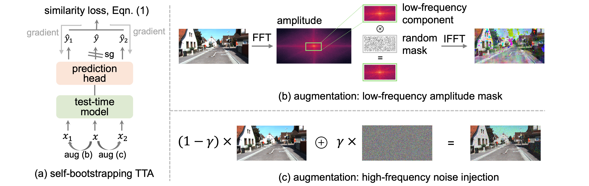

# Self-Bootstrapping for Versatile Test-Time Adaptation

This is the official project repository for [Self-Bootstrapping for Versatile Test-Time Adaptation (ICML 2025)](https://arxiv.org/pdf/2504.08010) by  Shuaicheng Niu, Guohao Chen, Peilin Zhao, Tianyi Wang, Pengcheng Wu, and Zhiqi Shen

* 1️⃣ SPA enables pre-trained classification and regression models to learn and adapt at test time to conquer potential distribution shifts in test data ☀️ 🌧 ❄️, such as corruptions, simulation-to-real discrepancies, and other differences between training and testing data.
* 2️⃣ SPA achieves the goal of unified, architecture-agnostic, and task-agnostic test-time learning through a self-bootstrapping learning scheme with two geometric-invariant augmentations, \ie, a low-frequency amplitude mask and a high-frequency noise injection, which provides sufficient learning signals for TTA while preserving the image's geometric structure to ensure its compatibility across image-🖼️, object-📦, and pixel🧩-level prediction tasks.


<p align="center">

</p>


**Dependencies Installation:**
```
pip install torch==2.1.0 torchvision==0.16.0 torchaudio==2.1.0 --index-url https://download.pytorch.org/whl/cu118
pip install timm==0.9.10
```

**Data Preparation:**

This repository contains code for evaluation on ImageNet-C/R/Sketch with VitBase and ResNet50-GN. But feel free to use your own data and models! Please check [here 🔗](dataset/README.md) for a detailed guide on preparing these datasets.

**Usage**
```python
from models.byol_wrapper import BYOLWrapper
import tta_library.spa as spa

model = TODO_model()
model = BYOLWrapper(net, projector_dim=projector_dim)
model = spa.configure_model(model)

params, param_names = spa.collect_params(model)
optimizer = TODO_optimizer(params)

adapt_model = SPA(model, optimizer, noise_ratio, freq_mask_ratio)
outputs = adapt_model(inputs)
```

# Example: ImageNet-C Experiments

**Usage**
```
python3 main.py \
    --data path/to/imagenet \
    --data_v2 path/to/imagenet-v2 \
    --data_sketch path/to/imagenet-sketch \
    --data_corruption path/to/imagenet-c \
    --data_rendition path/to/imagenet-r \
    --model [vitbase_timm/resnet50_gn_timm] \
    --algorithm [tent/actmad/eata/sar/deyo/cotta/spa/spa+tent/spa+eta/spa+eata] \ 
```


**Experimental Results**

The Table below demonstrates i) the classification result on ImageNet-C regarding accuracy (\%); ii) the 3D monocular object detection result on KITTI-C regarding the average precision of 3D bounding boxes $AP_{3D|R40}$ (\%); and iii) the segmentation result on Cityscape-to-ACDC regarding mIoU (\%). SPA\* denotes integration of SPA with prior TTA methods.

|  | Classification | 3D Detection | Segmentation |
| ------- | :----------: | :---------: | :---------: |
| NoAdapt | 55.5  |     7.2      |     56.7     |
| Tent | 59.6 |     15.0     |     55.9     |
| CoTTA |      61.7      |      -       |     58.5     |
| EATA |      67.8      |     15.2     |      -       |
| ActMAD |      66.3      |     13.8     |      -       |
| DeYO        |      66.0      |      -       |      -       |
| MonoTTA     |       -        |     16.9     |      -       |
| SPA (Ours)  |      70.1      |     18.4     |     59.7     |
| SPA\* (Ours) |      71.6      |     19.3     |     60.7     |

Please see our [PAPER 🔗](https://arxiv.org/pdf/2504.08010) for more detailed results.

# Correspondence

Please contact Shuaicheng Niu by [shuaicheng.niu at ntu.edu.sg] and Guohao Chen by [guohao.chen at ntu.edu.sg] if you have any questions. 📬

# Citation

If our SPA method or the active self-bootstrapping learning scheme for versatile test-time adaptation is helpful in your research, please consider citing our paper:

```
@inproceedings{niu2025spa,
  title={Self-Bootstrapping for Versatile Test-Time Adaptation},
  author={Niu, Shuaicheng and Chen, Guohao and Zhao, Peilin and Wang, Tianyi and Wu, Pengcheng and Shen, Zhiqi},
  booktitle = {The International Conference on Machine Learning},
  year={2025}
}
```

# Acknowledgment

The code is inspired by [FOA 🔗](https://github.com/mr-eggplant/FOA)